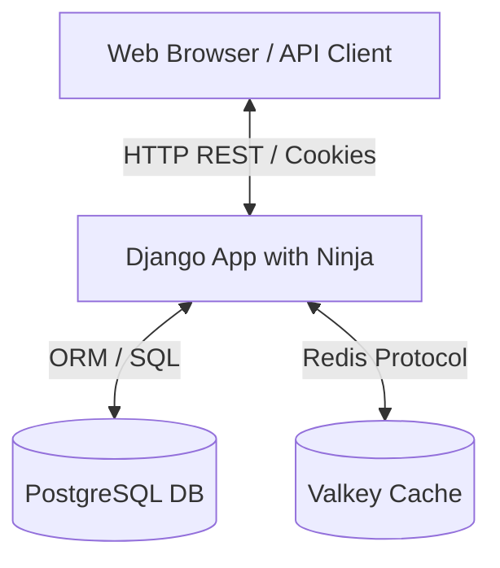
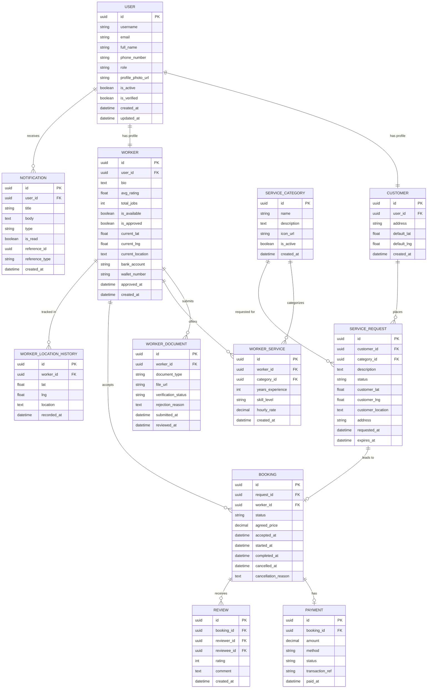
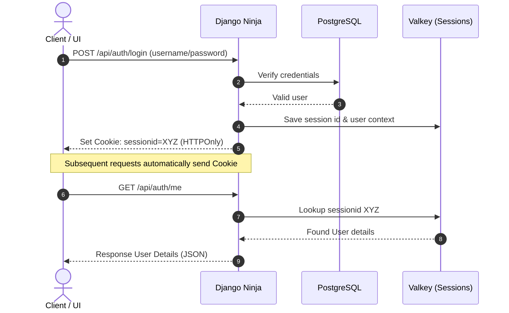

# Rojgari System Architecture & Design 🏗️

This document outlines the architectural components, database design, and caching flow of the Rojgari application. It is designed to help human developers quickly grasp how the parts connect and how to extend the codebase.

---

## 1. Component Topology

Rojgari is structured as a decoupled backend API service backed by high-performance data and caching systems.

* **Django Framework**: Serves as the web application server. We use [Django Ninja](https://django-ninja.rest-framework.com/) for building APIs with static type annotation and automatic Swagger documentation.
* **PostgreSQL**: The primary relational store. Handles user accounts, profiles, requests, bookings, payments, and reviews.
* **Valkey**: A high-performance, open-source caching server (wire-compatible with Redis). Used to cache database queries, sessions, and transient states.

---

## 2. Database Models (ER Diagram)

The database schema manages user accounts, distinct customer/worker profiles, service catalogs, requests, bookings, and tracking history.

### Models Reference
* **accounts**:
  * [User](file:///Users/pablo/Development/Projects/Rojgari/accounts/models.py#L5): Extends Django's `AbstractUser` with UUID primary key.
  * [Customer](file:///Users/pablo/Development/Projects/Rojgari/accounts/models.py#L23) & [Worker](file:///Users/pablo/Development/Projects/Rojgari/accounts/models.py#L38): Profiles linked 1:1 to [User](file:///Users/pablo/Development/Projects/Rojgari/accounts/models.py#L5).
  * [WorkerDocument](file:///Users/pablo/Development/Projects/Rojgari/accounts/models.py#L67): Worker verification uploads.
* **services**:
  * [ServiceCategory](file:///Users/pablo/Development/Projects/Rojgari/services/models.py#L5): Catalog categories.
  * [WorkerService](file:///Users/pablo/Development/Projects/Rojgari/services/models.py#L20): Links workers to their offered categories.
  * [ServiceRequest](file:///Users/pablo/Development/Projects/Rojgari/services/models.py#L35): Posted by customers.
* **bookings**:
  * [Booking](file:///Users/pablo/Development/Projects/Rojgari/bookings/models.py#L5): Match request and worker.
  * [Review](file:///Users/pablo/Development/Projects/Rojgari/bookings/models.py#L23): Performance feedback.
  * [WorkerLocationHistory](file:///Users/pablo/Development/Projects/Rojgari/bookings/models.py#L39): GPS track trail.
* **payments**:
  * [Payment](file:///Users/pablo/Development/Projects/Rojgari/payments/models.py#L5): Transaction records.
* **notifications**:
  * [Notification](file:///Users/pablo/Development/Projects/Rojgari/notifications/models.py#L5): System alerts.

---

## 3. Core Technical Flow

### Authentication Pattern
Rojgari uses Django's built-in session-based authentication coupled with Django Ninja's `django_auth` middleware.

1. **Registration**: [register](file:///Users/pablo/Development/Projects/Rojgari/accounts/api/auth.py#L10) creates a new `User` and automatically sets up a [Customer](file:///Users/pablo/Development/Projects/Rojgari/accounts/models.py#L23) or [Worker](file:///Users/pablo/Development/Projects/Rojgari/accounts/models.py#L38) profile based on the selected role.
2. **Login**: [login_user](file:///Users/pablo/Development/Projects/Rojgari/accounts/api/auth.py#L38) establishes a standard Django session.
3. **Session Cookie**: The client receives a secure, HTTP-only cookie. Django reads this cookie on subsequent requests using `django_auth` to populate `request.user`.

---

## 4. Development Standards & Style

* **Coding Style**: Follow PEP 8 guidelines. Type hint all view functions, endpoints, and helpers. Keep source format check compliant with Ruff.
* **API Versioning**: Endpoints are defined using Pydantic schemas (e.g. [UserOut](file:///Users/pablo/Development/Projects/Rojgari/accounts/api/schemas.py#L22)) for input validation and output serialization.
* **Test First**: Before adding any API modifications, write corresponding automated test cases in [accounts/tests.py](file:///Users/pablo/Development/Projects/Rojgari/accounts/tests.py).
